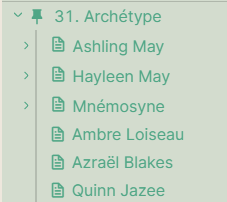

# Summary
- [WYSIWYG](https://github.com/Mara-Li/Obsidian-Snippet-collection#wysiwyg-and-pseudo-wysiwyg)
- [Colored Folder](https://github.com/Mara-Li/Obsidian-Snippet-collection#colored-folder)
- [Folder Icons](https://github.com/Mara-Li/Obsidian-Snippet-collection#folder-icons)

⚠️ For IOS : If you don't have Textastic (can open `.obsidian` folder) you need to use shortcuts and toolbox pro to open hidden folder. 
You can also use [ashell](https://holzschu.github.io/a-Shell_iOS/) (Free) to open `.obsidian` and file !

# WYSIWYG and Pseudo WYSIWYG
## Wysiwyg code mirror companion
It's a little snippet that must be used with the plugin [Code Mirror Options](https://github.com/nothingislost/obsidian-codemirror-options). It works only for PC.

## PureCSS
Check the pureCSS branch to get the old version.

## Information about mobile support
On mobile, the code mirror version used is **Code Mirror 6**, not **Code Mirror 5**. So, activeline doesn’t work. I use another “tricks” to create a WYSIWYG view. For example :
- You will see the formatting with a little size and opacity.
- Link will be replaced by a icon, but you can always go to them, and you can saw them with backspace.
- Task will be replaced by symbol. To add the x, just go in and add it, you will see the update. Yeah, it's a little strange and tricky. I advice you to use the preview to check your task.

Also, I test only on IOS / IpadOS. If you saw any problem on android, please, provide an issue and a solution. I can't check for android for that.

## Installation

It's more an advice than an obligation, but I update a lot this, so unless you want to download / check the page each minute...

1. Clone this repository in your `.obsidian/snippet`
2. Move `.git`, and `wysiwyg.css` snippet in your folder. 
3. Delete the `Obsidian-WYSIWYG` folder.

Now, each time there is a update, you can just do `git pull` in a terminal/cmd. You can create a task for that, because sometimes I will not warn user each time !

Note : With this setup, you **will not be able** to edit the file, because each update erase your personal edit. Create another snippet OR create a pull request/issue with your personal edit. 

---
# Colored Folder
You can change the color with style settings.

---

# Folder Icons
## Folder Note
[Folder note](https://github.com/aidenlx/alx-folder-note) is a good plugin but it doesn't provide icon. This snippets is an example of styling.

## Icon Folder plugin snippet
The plugin [icon folder](https://github.com/FlorianWoelki/obsidian-icon-folder) provide a better way to add icon to your folder. 
The snippet :
- mini.folders.icons provide some CSS for file 
- folders.colored add color to your folder name.

## Pure CSS
→ This are moved in the branch ('PureCSS_icons')
