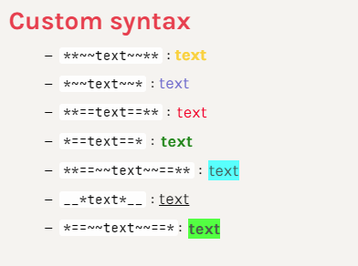
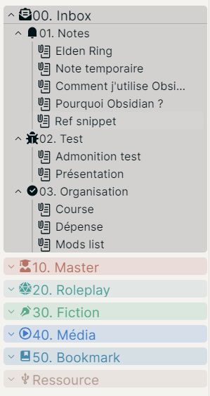

This repo is a collection of CSS snippets for [Obsidian.md](https://obsidian.md/).

To install them on PC:
- Put the snippets in the `snippet` folder of `.obsidian` in the root of your vault;
- In Obsidian: Appearance → Refresh snippets ⇒ Activate the ones you want.

:warning: In IOS, it is impossible to access hidden folders. You can:
- Use Textastic
- Working Copy with a link to a folder
- a-shell
[For more information](https://forum.obsidian.md/t/mobile-ios-app-to-work-with-hidden-folder/25741)

Each snippets can be adjusted with [Style Settings](https://github.com/mgmeyers/obsidian-style-settings/).

# Custom Syntax
This is a simple snippet that allows a specific formatting using markdown syntax, without using HTML.

References :
- `**~~text~~**` : Yellow text
- `*~~text~~*` : Blue text
- `**==text==**` : Red text
- `*==text==*` : Bold green text
- `__*text*__` : Underline
- `**==~~text~~==**` : Cyan Highlight
- `*==~~text~~==*`: Green highlight

# Folder Note :

:warning: This snippet is mostly present in terms of EXAMPLE. 

This snippet allows you to turn a folder into a note, by moving the various icons in a folder.
To use it you need :
- [Folder Note](https://github.com/aidenlx/alx-folder-note)
- [Icon Folder](https://github.com/FlorianWoelki/obsidian-icon-folder)

The file [sanctum tweaks](sanctum_tweaks.css) allows the necessary adjustments to this theme.

:warning: You need to change the paths of your files!

# Colored files & folder

*All credits goes to Javalent for his [original snippet](https://github.com/valentine195/Obsidian-Vault/blob/master/.obsidian/snippets/colors.folders.css).*

> Associated files start with `folder-color`.

This snippet allows:
- Add colors for each folder numbered from 00 to 100 
- Add lines for the children files of a folder

In case the lines don't match with the icons, you can adjust them with Style Settings, just like the colors.

# Icons
These snippets add somes icons for unsupported files.
The `icons_font.css` embed somes font, so you can use in multiple snippets if you want !
Font included :
    - boxicons (old and new version)
    - remixicon (old and new version)
    - Material Icons
    - IcoMoon Free
    - Font Awesome 5 Free
    - Font Awesome 5 Free Solid
    - Font Awesome 5 Brands

# Image Float

All of the credit for this snippet to go [Lithou](http://github.com/lithou/sandbox). I just adapted this snippet to work with Live Preview. I pretty didn't know if Lithou updated it.

# Sanctum Tweaks

This snippet add support for my folder_note, folder-color snippet and edit some things in Sanctum :
    - Aspect of Links, since the 6.0.1, where I don't like the new link's aspect.
    - A specific font for comments 
    - Some tweaks around bullet or codes

